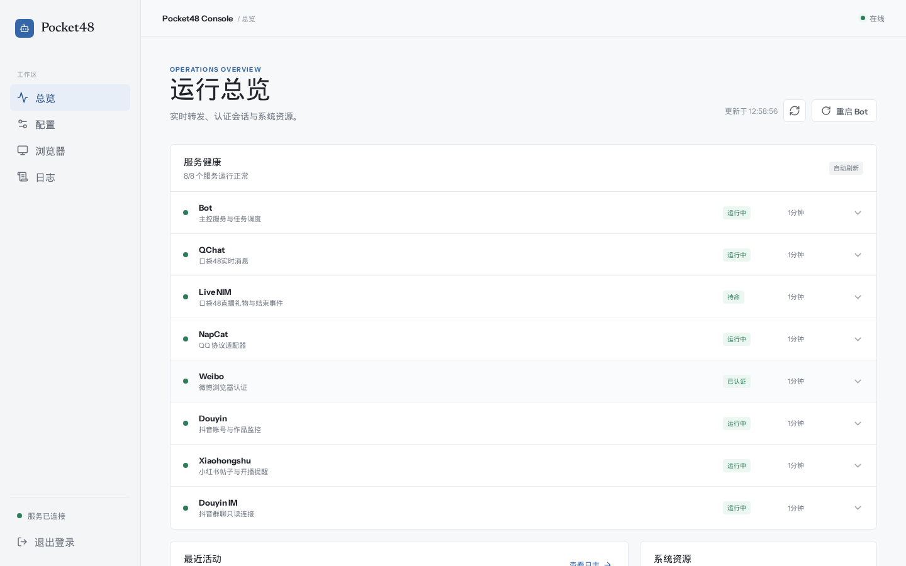
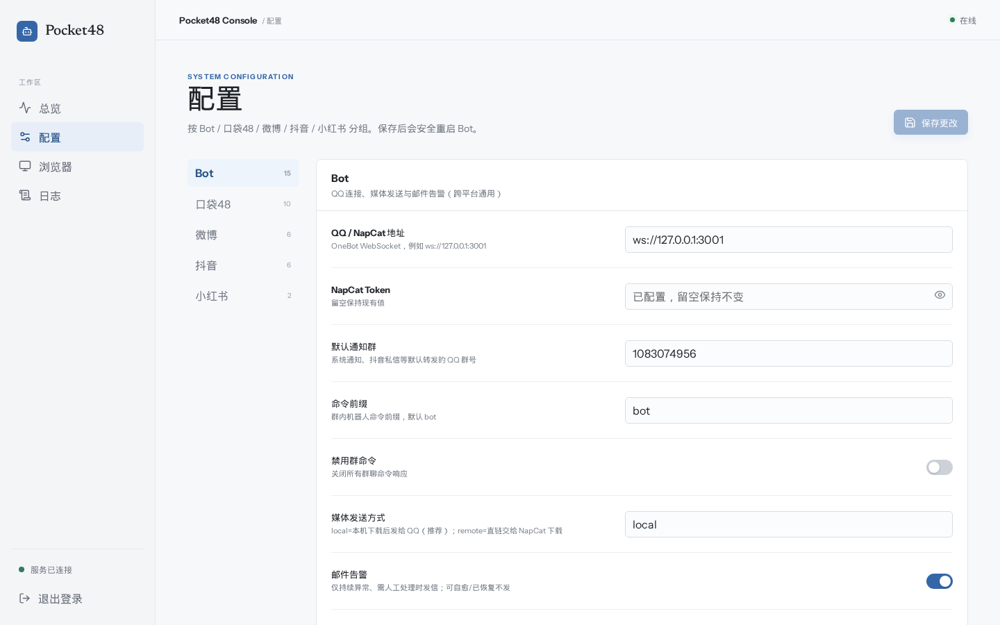
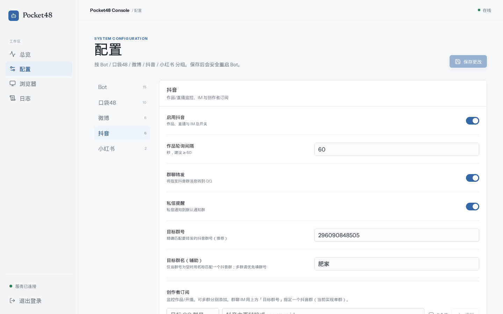
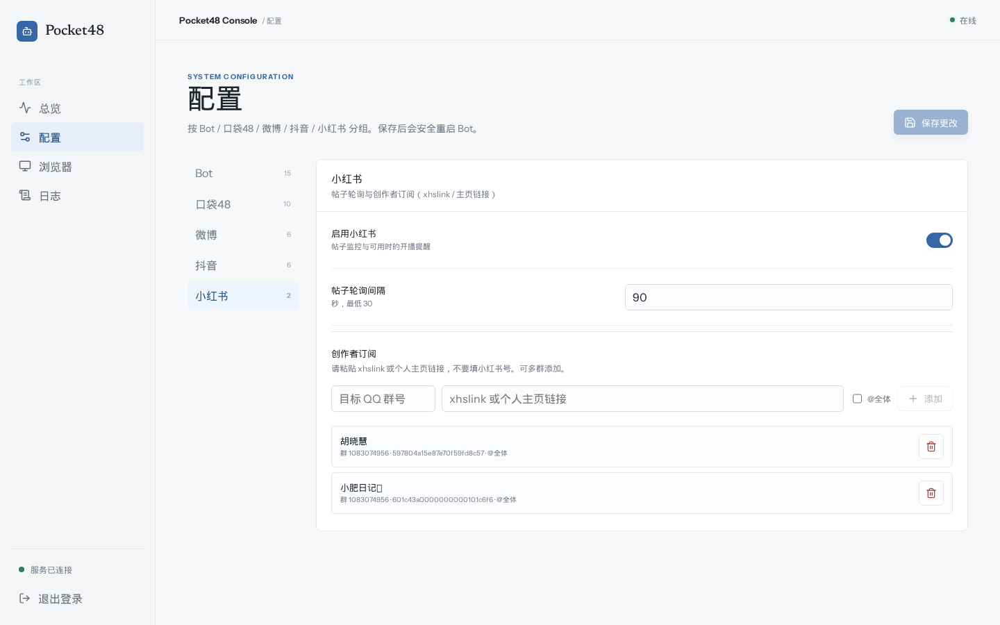

# Pocket48 Bot

基于 Go 的 **口袋48** 消息监控机器人，对接 [NapCat](https://github.com/NapNeko/NapCatQQ) (OneBot v11) QQ 机器人框架。

通过 NIM 实时通道（并保留 REST 轮询兜底）监控小偶像的口袋房间、直播间和微博动态，将消息转发到 QQ 群。

## 功能

### 管理面板截图

开箱后可在浏览器打开管理台（默认本机 `http://127.0.0.1:8787`，密码见部署配置）。

| 总览 | 配置（Bot） |
| :---: | :---: |
|  |  |

| 抖音订阅 | 小红书订阅 |
| :---: | :---: |
|  |  |

配置页按 **Bot / 口袋48 / 微博 / 抖音 / 小红书** 分组；各平台页底部可直接添加/删除订阅（不必只靠 QQ 命令）。


### 📱 口袋48 房间监控
- **文本/图片/语音/视频** 消息转发
- **QChat 实时推送**：连接成功后停止对应房间的 REST 轮询，断线自动恢复轮询
- 回复消息、翻牌（FlipCard）消息解析
- 直播开播通知（含封面图）
- 礼物消息（含年度青春盛典记分礼物）；直播间**记分与鸡腿分桶累计**，下播汇总推送
- 本场统计落盘 `storage/live-sessions/`，Bot 重启后同场 `liveId` 可恢复累计
- 成员/star 校验走档案接口 + 负缓存（修复用户主页接口 404 导致校验失灵）
- 上麦提醒
- **自适应轮询**：有消息 300ms 快速拉取，安静期 1s 保底
- **媒体缓存**：图片/语音/视频预下载到本地，加快 NapCat 发送

### 🐼 微博监控
- **主页微博**动态监控
- **超话发帖**监控（指定 uid 在指定超话的发帖）
- **超话签到**（手动/自动每日签到，失败可重试）
- **超话签到人数**查询与日排行（分组、涨跌、QQ 推送）
- **超话日报邮件**（可选）：单封 HTML 多表 + 3:4 卡片 PNG；字段含签到/帖子/粉丝/等级/阅读等（有数据才出列）
- **三套认证**独立维护：AppAuth / weibo.com Cookie / m.weibo.cn Cookie
- **AppAuth 主动健康检查**（每 2 小时，失效/恢复自动通知管理员）
- **Web Cookie 自动维护**：持久化浏览器 Profile，Cookie 失效时向管理员私聊登录二维码

### 🎵 抖音监控
- 指定账号的新视频、图文作品监控，自动过滤置顶旧作品
- 持久化 Chromium Profile，可由管理员按需扫码登录
- 开播、下播实时通知，直播结束汇总直播时长和最高人气（`liveUpdateInfo.online` / `onlineNum`，整场只升不降，属人气/人次，非实时并发在线）
- 多群独立订阅与作品游标，支持按群配置 `@全体成员`
- **IM 只读转发**（可选）：私信 + 指定群的群主消息 → QQ（不回写抖音）
- 私信标题格式：`【昵称|抖音】`；图片消息经桥接透传 URL；部分客户端卡片（如 type=110 空正文）有可读占位
- 私信**回复**尽量拆成引用栈：`我/对方：【分享图文|视频 标题】` + `对方：正文`；短时双推（约 3s）软去重
- IM 断连自愈：软告警 → 侧重启 → Bot 进程重启（systemd）→ 仍未恢复再告警

### 📕 小红书监控（**不建议启用**）
- 个人主页新帖（图文/视频）推送，首次只建基线不刷历史
- **主路径**：页内 `mnsv2 → XYS_` 签名 + 缓存 `X-S-Common` / `x-rap-param` → `user_posted` API（失败**不** goto 用户主页）
- 登录态：Chromium Profile + `weibo-storage-state.json`（cookie + 小红书 localStorage）；登录成功才 force 写盘，失败扫描不覆盖好会话
- 游标防洪水：只转发约 **12 小时内**新帖、单次最多 3 条；游标落后过多只跳游标不灌历史
- 可选 `BROWSER_PROXY_SERVER` 给浏览器挂代理；**不建议**自动轮换出口（易冲登录/风控）
- 复用微博/抖音同一 Chromium Profile；登录二维码私聊管理员
- 保守开播提醒（主页明确出现直播入口才通知；无弹幕/人数/下播统计）
- **视频帖**：QQ 侧目前稳定发封面图 + 小红书链接，列表接口**不保证**视频文件本体
- **浏览器内存**：侧卡默认 `--renderer-process-limit=4`；每 5 分钟 prune 孤儿页并打 `browserDiag`
- ⚠️ **风控与稳定性（2026-07）**：实战中拉帖极不稳定——`user/me` 常为 guest、`user_posted` 易 461、扫码后仍可能被判定游客或账号异常，甚至触发平台违规提醒。**默认请保持 `XIAOHONGSHU_ENABLED=false`，不建议生产依赖本链路。** 紧急停扫可 touch `storage/xhs-scan-paused`。

### 🖼️ 消息转发
- 图片自动下载并转为 Base64 发送（兼容 NapCat）
- 语音消息文件转发
- 视频消息文件转发
- 媒体缓存自动清理
- **媒体发送方式** `MEDIA_DELIVERY`：`local`（默认，本机下载再给 NapCat）或 `remote`（直链交给 NapCat 下载）

### ⚙️ 系统特性
- 多群分组订阅（不同群监控不同房间）
- COS 归档存储（消息自动归档）
- 自适应轮询间隔


### 📧 邮件告警与日报

- **不是只能 Linux**：推荐配置 **SMTP**（QQ 邮箱填授权码、`smtp.qq.com`、端口 465/587）。Windows 必走 SMTP。
- Linux 若本机已装 MTA，可把 `ALERT_EMAIL_SMTP_HOST` 留空，回退 `/usr/sbin/sendmail`（不推荐跨平台依赖）。
- 相关字段：`ALERT_EMAIL_ENABLED` / `TO` / `FROM` / `SMTP_HOST` / `SMTP_PORT` / `SMTP_USER` / `SMTP_PASSWORD` / `COOLDOWN_MINUTES`
- 可选 `ADMIN_PANEL_URL`：写进告警邮件的「打开管理面板」按钮；**留空则不写死任何作者域名**。
- 策略：服务持续异常且超过自愈观察窗口才发邮件；已恢复不发。


### ⚡ NIM 实时监控（可选）

项目内置 `sidecar/nim-bridge` Node.js 侧卡：在 Linux 上直接实现新版 Android NIM 二进制协议，使用登录态 Chatroom 接收直播弹幕、礼物、在线人数和成员进出事件，并使用登录态 QChat 接收普通房间消息。Go 端通过本机 WebSocket 与侧卡通信，支持同时连接多个直播间；不依赖网易原生库、旧 Web SDK 或匿名回退。

| 实时链路 | 协议 | 开关 | 当前状态 |
| :--- | :--- | :--- | :--- |
| 直播间 | NIM Chatroom | `NIM_ENABLED` | 已完成真实入房和弹幕收包验证 |
| 普通房间 | NIM QChat | `NIM_ROOM_MESSAGE_ENABLED` | 已完成真实登录和订阅验证，支持断线轮询兜底 |

运行侧卡需要 Node.js 18+。从源码部署时安装依赖：

```bash
cd sidecar/nim-bridge
npm ci
cd ../..
```

如果使用的 Release 压缩包没有包含 `sidecar/nim-bridge`，需要从同版本源码复制该目录到 Bot 工作目录，再执行上述 `npm ci`。只启用 REST 轮询时不需要 Node.js。

然后在 `config.json` 中启用需要的通道：

```json
{
  "NIM_ENABLED": true,
  "NIM_SIDECAR_CMD": "node ./sidecar/nim-bridge/index.mjs",
  "NIM_LIVE_DANMAKU_ENABLED": true,
  "NIM_VIEWER_EVENT_ENABLED": false,

  "NIM_ROOM_MESSAGE_ENABLED": true,
  "MEDIA_DELIVERY": "local",
  "ALERT_EMAIL_SMTP_HOST": "",
  "ALERT_EMAIL_SMTP_PORT": 465,
  "ADMIN_PANEL_URL": "",
  "NIM_ROOM_MESSAGE_POLL_FALLBACK": true
}
```

- Bot 会使用有效的 `POCKET_TOKEN` 调用 `/im/api/v1/im/userinfo`，自动取得并保存云信 AccID/Token，通常不需要手工配置 `NIM_ACCOUNT/NIM_TOKEN`。
- `NIM_ENABLED` 只控制直播 Chatroom；`NIM_ROOM_MESSAGE_ENABLED` 独立控制普通房间 QChat，两项可分别启用。
- 直播弹幕/进出房只转发**判定为口袋成员（star）的其他用户**（排除本场房主与粉丝）。判星优先 `GetStarArchives(memberId)`（`/user/api/v1/user/star/archives`），再 fallback 用户主页接口；**负缓存**失败/非成员，避免对同一 ID 反复 404 刷日志。全站身份，不是「仅订阅房间列表」。
- 普通观众弹幕和单条礼物**不**实时转发 QQ。
- 礼物累计分桶（互斥）：
  - **总选记分**：`isScore/is_score=true` 且有 `tpNum` 等 → 只加 `AnnualScore`
  - **鸡腿**：非记分礼物，按优先级取值 → 只加 `ChickenLegs`
    1. raw 含 `totalChickenLeg*`（会话总数，直接累计）
    2. raw 含 `chickenLeg*`（单价 × 数量）
    3. **兜底 `giftInfo.money`**：2026-08-21 双端抓包证实，NIM 直播礼物 payload 已不再下发任何 `chickenLeg*` 字段，只有单价 `money`（直播弹幕=10、荧光棒-NII=5、心锁=480、高级马卡龙=1048、皇冠=5000），鸡腿值按 `money × giftNum` 累计（source=`raw.giftInfo.money`）
  - 记分礼物（`isScore=true`）即使带 `money` 也不会进鸡腿桶；`直播弹幕` 礼物（带 `attachData.text`）按 money=10 计入鸡腿
- 礼物字段探针（排查用，自动限流）：解析失败时 Node 侧把完整 custom 落盘 `storage/gift-raw-dumps/`（≤200 个/进程），Go 侧落盘 `storage/gift-raw-dumps-go/`（≤20 个/进程）并打 `GIFT-GO-RAW` 日志（含 keys 与 rawHead 前 600 字符）。
- 日志 `[NIM-live] gift in ... source=score-only|…unitChicken|…money`；**不**实时刷屏。`getLiveList` 从 `userInfo` 解析主播以便发现进行中的直播。
- 本场累计写入 `storage/live-sessions/<房间ID>.json`（git 忽略），重启后同 `liveId` 会 `resume session` 接着累。
- 直播结束优先 NIM `CLOSELIVE`，并以直播列表消失作兜底；结束通知格式：
  `【房主|频道】` + 可选行：记分值 / 鸡腿值 / 最高人气 / 直播时长（对应值 >0 才输出）+ 时间戳；**不写**「直播已结束」行。最高人气取 LIVEUPDATE 的 `liveUpdateInfo.online`（或 `onlineNum`）；实测只升不降，是人气/人次不是实时在线。下一场直播会把原始 LIVEUPDATE JSON 落到 `storage/live-liveupdate-dumps/` 以便继续找会波动的并发字段。
- 直播弹幕 / 其他偶像进出：与房间消息同款 `【房主|频道】` 骨架（弹幕为 `昵称: 内容`；进出为 `昵称进入/离开了直播间`，可选观看时长），末行时间戳；不加 💬/👀 前缀。
- `NIM_VIEWER_EVENT_ENABLED=true` 时转发其他小偶像进入/离开**当前已连接**直播间的事件；无法跟踪未订阅房间/未连接直播间的全站行踪。
- 房间实时消息通过纯协议 QChat 接收。连接成功后对应房间停止 REST 轮询；QChat 断线时，`NIM_ROOM_MESSAGE_POLL_FALLBACK=true` 会自动恢复轮询。
- 侧卡仅监听 `127.0.0.1` 的随机端口，不对局域网或公网开放。

### 🐼 微博 Web Cookie 自动维护（可选）

项目内置统一的 `sidecar/weibo-auth` 浏览器侧卡。微博认证和抖音作品监控共用一个 Chromium 进程与一个持久化 Profile，但使用不同页面；Cookie 仍由浏览器按域名隔离。微博部分不修改 AppAuth，也不替代现有微博监控逻辑：

1. Chromium 使用固定 Profile，并额外保存 `storageState`，重启后复用登录态；
2. 定期访问移动端和网页端完成 CookieJar 预热，将服务器下发的新 Cookie 热更新给 Go；
3. 登录彻底失效时生成微博登录二维码，通过 NapCat 私聊发送给超级管理员和管理员；
4. 扫码成功后自动更新两套 Cookie，无需重启 Bot。

Linux 首次部署需要安装侧卡依赖和 Chromium：

```bash
cd sidecar/weibo-auth
npm ci
npx playwright install --with-deps chromium --no-shell
cd ../..
```

在 `config.json` 中启用：

```json
{
  "WEIBO_BROWSER_AUTH_ENABLED": true,
  "WEIBO_BROWSER_AUTH_CMD": "node ./sidecar/weibo-auth/index.mjs",
  "WEIBO_BROWSER_PROFILE_DIR": "./storage/weibo-browser-profile",
  "WEIBO_BROWSER_HEADLESS": true,
  "WEIBO_BROWSER_REFRESH_MINUTES": 30
}
```

- 首次启用且没有有效登录态时，Bot 会自动私聊二维码；使用微博 App 扫码即可。
- Profile 和 `storageState` 位于 `storage/`，该目录已被 Git 忽略。目录权限会设置为 `0700`，状态文件权限设置为 `0600`；仍应像保护账号密码一样保护服务器文件。
- 微博强制风控、账号退出或要求额外验证时，无法保证完全无人值守；Bot 会重新发送二维码作为兜底。
- 为避免管理员消息轰炸，登录二维码生成后有 2 小时冷却时间。
- `WEIBO_BROWSER_REFRESH_MINUTES` 最小为 5 分钟，缺省为 30 分钟。侧卡只监听本机随机端口。

### 🎵 抖音作品与直播监控（可选）

抖音作品监控复用上面的统一浏览器侧卡，使用独立页面打开创作者主页，读取网页自身已经签名的作品接口响应；Bot 不保存或复用 `a_bogus`。首次扫描只建立作品游标，不会把已有作品全部刷到群里。

Linux 安装浏览器侧卡：

```bash
cd sidecar/weibo-auth
npm ci
npx playwright install --with-deps chromium --no-shell
cd ../..
```

直播实时链路使用独立的 [jwwsjlm/douyinLive](https://github.com/jwwsjlm/douyinLive) 本地 WebSocket 服务。可以把它作为 systemd/Docker 服务独立启动，也可以通过 `DOUYIN_LIVE_SIDECAR_CMD` 让 Bot 作为子进程启动；Bot 不直接链接其 Go 1.26 依赖。

Linux 可用仓库内的安装脚本下载并校验固定版本的官方发布包：

```bash
./scripts/install_douyin_live_sidecar.sh
```

```json
{
  "DOUYIN_ENABLED": true,
  "BROWSER_SIDECAR_CMD": "node ./sidecar/weibo-auth/index.mjs",
  "BROWSER_PROFILE_DIR": "./storage/weibo-browser-profile",
  "BROWSER_HEADLESS": true,
  "DOUYIN_POLL_SECONDS": 60,
  "DOUYIN_LIVE_WS_URL": "ws://127.0.0.1:1088/ws",
  "DOUYIN_LIVE_SIDECAR_CMD": "./storage/bin/douyinLive --config ./deploy/douyin-live.yaml",
  "DOUYIN_LIVE_SUMMARY_ENABLED": false,
  "DOUYIN_LIVE_SOUND_WAVE_ENABLED": false,
  "DOUYIN_LIVE_RAW_STATS_DEBUG": false,
  "DOUYIN_LIVE_RAW_GIFT_DEBUG": false,
  "DOUYIN_LIVE_COOKIE_KEYRING_ACCOUNT": "",
  "DOUYIN_IM_ENABLED": true,
  "DOUYIN_IM_PRIVATE_ENABLED": true,
  "DOUYIN_IM_GROUP_NAME": "目标群显示名",
  "DOUYIN_IM_GROUP_NUMBER": "目标群号"
}
```

- `DOUYIN_LIVE_SIDECAR_CMD` 留空时，Bot 连接已经运行的 `DOUYIN_LIVE_WS_URL`；连接断开会指数退避重试。
- 如果填写命令，例如 `./douyinLive --port 1088 --log-level info`，Bot 启停时会一并管理该进程。
- 浏览器只从被监控用户自己的资料接口提取直播状态和 `web_rid`，不会采用页面推荐区中其他主播的直播间。首次发现该用户开播后会保存 `live.douyin.com/<ID>`，以后 Bot 可在其离线期间保持本地直播 WebSocket 连接，并按 `ROOM_ONLINE`/`ROOM_ENDED` 通知群。
- 直播链路只消费 `ROOM_ONLINE`/`ROOM_ENDED` 状态并发送开播、下播通知。聊天、在线人数、礼物、钻石、粉丝票和 PK 等高频事件会立即丢弃，不写数据库或调试样本。
- 公开主页通常可在未登录状态读取；需要登录时由管理员显式执行 `bot douyin login`，二维码只私聊超级管理员和管理员。
- 微博和抖音只启动一个 Chromium；Profile 位于 `storage/` 且不会提交到 Git，仍应按账号凭据保护。
- 抖音**作品**扫描优先复用创作者主页中由页面自身签名的作品响应；服务端 Cookie+HTTP 被 403 拒绝时按账号独立退避，并受控使用浏览器页降级。每个创作者有独立硬超时并在扫描后释放临时页，单个页面卡死不会冻结其余订阅。`bot douyin login` 打开的登录页在成功/过期后会关闭以省内存，抖音 **IM** 仍需长驻 IM 页。
- `BROWSER_*` 是统一浏览器配置；原有 `WEIBO_BROWSER_AUTH_CMD`、`WEIBO_BROWSER_PROFILE_DIR`、`WEIBO_BROWSER_HEADLESS` 仅作为旧配置兼容回退，不会再启动第二个浏览器。
- 需要监控的账号统一保存在 `DOUYIN_SUBSCRIPTIONS`。可通过管理面板「配置 → 抖音 → 创作者订阅」添加、编辑、启停、删除，也可使用 `bot douyin add/del`；两者读写同一模型。每个订阅可分别开启作品或直播监控，多 QQ 群订阅和各自的 `AtAll` 设置会分别保留。面板会记住最近使用的目标群号；昵称由浏览器解析，也可填写备注。
- 每场直播使用独立 SessionID 保存最小通知状态，不会把可复用的主页 `LiveID/web_rid` 当成永久场次 ID。Bot 重启和 WebSocket 重连会恢复尚未完成的通知。
- 通知按群保存 `pending → queued` 状态：先持久化 pending，进入 NapCat 发送队列后才逐群标记 queued。崩溃窗口采用 at-least-once 语义，极端情况下可能重复，但不会因提前标记而永久漏发。
- 本地 sidecar 负责抖音 WebSocket 的 gzip、ACK 与重连，Bot 连接断开时指数退避。已保存 `live_id` 的账号不再反复打开创作者主页；慢扫描未结束时丢弃重复定时任务，避免浏览器连续导航。
- 默认匿名连接。如目标消息确实要求登录，运行 `pocket48-douyin-cookie --account default` 将 Cookie 写入 Windows Credential Manager、macOS Keychain 或 Linux Secret Service，再把 `DOUYIN_LIVE_COOKIE_KEYRING_ACCOUNT` 设为 `default`。用 `--status` 检查、`--clear` 清除。程序不会读取浏览器 Cookie，Cookie 也不会写入配置、SQLite 或日志。
- 原始统计/礼物调试键仅为兼容旧配置保留；提醒模式不会保存这两类样本。
- IM 使用 `frontier-im.douyin.com` 的只读 WebSocket 推送。群聊优先按群号精确匹配，再从初始化包取得内部会话 ID 和群主 UID；只有该会话中群主发送的消息会转发到 `BOUND_GROUP_ID`，其他成员消息直接丢弃。
- 私聊只转发“发送者不是当前登录账号”的新消息，并且只私聊 `SUPER_ADMIN`/`ADMIN_QQ`，不会发到 QQ 群；QQ 文案标题为 `【昵称|抖音】`（不再写「抖音私信」）。
- IM WebSocket 长时间断开时：先告警，约 2 分钟重启浏览器侧车，约 5 分钟退出进程由 systemd 拉起 Bot，约 8 分钟仍未恢复再告警（有冷却，避免刷屏）。
- 抖音 IM 模块没有创建会话、回复或发送消息的实现，也不会向抖音群或私聊主动发消息。首次启用只会建立当前消息基线，不转发历史消息。

可在已经登录的机器上执行只读联调（只输出群名、群号和特别关注数量）：

```bash
cd sidecar/weibo-auth
npm run test:douyin-im
```

### 📕 小红书帖子监控（可选 · **不建议生产启用**）

> ⚠️ **先看结论（2026-07 实战）**  
> 小红书对自动化风控很严，本链路**不稳定**，不建议作为日常监控依赖。常见现象包括：  
> - 浏览器 Cookie / `web_session` 已落盘，但 `user/me` 仍为 **guest**，`user_posted` 返回 **HTTP 461** 或 notes=0  
> - 扫码“登上去”后很快失效，或页面刷新后再次要求登录  
> - 持续轮询可能加重账号/环境异常，甚至触发平台违规提醒  
> **默认请保持 `XIAOHONGSHU_ENABLED=false`。** 若必须调试：先 `touch storage/xhs-scan-paused` 停自动扫，只做登录与探针；确认安全后再删该文件并开启总开关。

小红书复用微博/抖音的持久化 Chromium，不需要额外 sidecar。**当前主路径**是登录页（explore）上的页内签名后调用 edith `user_posted`，而不是每轮 `goto` 用户主页扒 DOM：

1. 浏览器保持登录（Profile + `weibo-storage-state.json`，含 cookie 与小红书 localStorage）
2. 页内 `mnsv2` 生成 `XYS_`，并尽量带上缓存的 `X-S-Common` / `x-rap-param`（版本号优先读页面 `webBuild`）
3. `fetch` `user_posted?user_id=…` 拉笔记列表；**API 失败不再 goto 用户主页兜底**
4. 登录失效（`login-dead` / guest / `-100`）时**禁止**自动刷小红书页；需面板扫码重登
5. 失败扫描**不会**用空 cookie 覆盖已落盘的好会话；面板热重载 SIGHUP **只打 bot 主进程**（避免误杀 Chrome）
6. 紧急停扫：存在文件 `storage/xhs-scan-paused` 时跳过自动扫描（可与总开关叠加）

实现仍参考 [jackwener/xhs-cli](https://github.com/jackwener/xhs-cli) / [xpzouying/xiaohongshu-mcp](https://github.com/xpzouying/xiaohongshu-mcp) 的登录与页面实践；**没有**稳定的纯进程外 HTTP 复刻（签名依赖页内 VM）。

```json
{
  "XIAOHONGSHU_ENABLED": false,
  "XIAOHONGSHU_POLL_SECONDS": 60,
  "BROWSER_PROXY_SERVER": "",
  "XIAOHONGSHU_SUBSCRIPTIONS": {}
}
```

> ⚠️ **坑（先看）**
> - **浏览器 `healthy` / Cookie 在 ≠ 能拉帖**：应用 `notes_ok` / 管理面板 Attention / `user/me` **非 guest** 判断。
> - **短链 `xhslink` 需解析为内部 `user_id`** 后再订阅；不要手填无效 ID。
> - 用户说「登好了」后仍应执行 `bot xiaohongshu scan` 验证 notes>0；不要只看侧卡状态绿灯。
> - 登录态与微博/抖音共用 `BROWSER_PROFILE_DIR`，**按账号凭据保护**，勿提交 Git。
> - 风控：建议轮询 ≥60 秒（默认/回落 60）；程序强制最低 30 秒，并串行访问账号。
> - **勿频繁侧重启 / 自动切代理 / 狂刷 explore**：会冲登录并加重风控；`api_stuck` 默认**不**静默重启浏览器。
> - 游标：首次成功只建基线；之后仅转发约 **12 小时内**且相对游标更新的帖，单次最多 3 条；落后过多只跳游标。
> - **视频本体**：列表接口通常只有封面；QQ 转发封面 + 链接，点开小红书看正片。
> - **内存诊断**：日志中的 `browserDiag(...)` 会打印当前标签角色/URL 摘要与 node heap；出现大量 `orphan` 页再考虑侧重启。
> - **HTTP 461 + msg「成功」** 多为环境/风控 opaque 错误，**不等于**“必须立刻扫码重登”；先停扫、查代理/IP，再决定是否登录。

- 管理面板「配置 → 小红书」可设轮询周期、按 QQ 群增删个人主页订阅；订阅与轮询等多数字段热重载，总开关等标「需重启」的项仍需重启 Bot。
- 命令：`bot xiaohongshu add <个人主页链接|内部 user_id> [at_all]` 等，见下方命令表。
- `bot xiaohongshu login` 把登录二维码私聊给管理员。
- 开播提醒是保守附加能力：仅当主页明确出现直播入口时才通知；**无**弹幕/人数/下播统计；无法可靠识别时不猜测。

## 快速开始

### 1. 下载或编译

**方式一：从源码编译（推荐运维机）**

需要 Go 1.22+（见 `go.mod`）。在**目标机器同架构**上编译最省事：

```bash
git clone git@github.com:sjsj1849/pocket48-bot.git
cd pocket48-bot
git checkout v0.2.6   # 或最新 tag
go build -o pocket48-bot ./cmd/bot
# 可选：管理面板二进制（内嵌 admin-ui）
go build -o pocket48-admin ./cmd/admin
./pocket48-bot
```

启用 NIM / 浏览器侧卡时还需在对应目录 `npm ci`（见上文侧卡章节），并保证 `sidecar/` 与二进制同工作目录。

**方式二：下载 Release 预编译包（可选）**

从 [Releases](https://github.com/sjsj1849/pocket48-bot/releases) 下载与你系统匹配的压缩包（若该版本附带了 assets）：

| 你的平台 | 下载哪个 |
| :--- | :--- |
| Linux 服务器 (x86_64) | `pocket48-bot-*-linux-amd64.gz` |
| Linux 服务器 (ARM) | `pocket48-bot-*-linux-arm64.gz` |
| Windows | `pocket48-bot-*-windows-amd64.zip` |
| macOS Intel / Apple Silicon | `*-darwin-amd64.gz` / `*-darwin-arm64.gz` |

> **为什么要分平台打包？**  
> Go 默认编译出的是**当前机器架构的本地可执行文件**，不能像脚本一样跨系统直接跑：  
> - `linux-amd64` 不能在 Windows / macOS 上执行  
> - `darwin-arm64`（Apple Silicon）不能在 Intel Mac 或常见 Linux 云主机上执行  
> 分平台包 = 用 `GOOS`/`GOARCH` 交叉编译后分别上传，方便没有 Go 环境的用户「下了就能跑」。  
> **若你始终在服务器上 `go build`，其实只需要源码 tag，不必依赖多平台包。**  
> 预编译包通常**不含** `node_modules`；NIM/浏览器侧卡仍需本机安装 Node 依赖。

```bash
# Linux / macOS 预编译示例
gunzip pocket48-bot-*.gz
chmod +x pocket48-bot-*
./pocket48-bot-*
```

### 2. 安装 NapCat

NapCat 是一个 QQ 机器人框架，负责接收和发送 QQ 消息。**装完必须配置反向 WebSocket 连接**，bot 才能通过 WebSocket 主动连上 NapCat。

**安装方式（选一种）：**

- **Linux 一键脚本**（推荐服务器用）：
  ```bash
  curl -o napcat.sh https://nclatest.znin.net/NapNeko/NapCat-Installer/raw/main/install.sh
  bash napcat.sh
  ```
  安装后 NapCat 默认会在 `~/.local/share/QQ/` 下

- **Docker 安装**：
  ```bash
  docker run -d \
    --name napcat \
    -p 6099:6099 \
    -p 3001:3001 \
    -v ~/.config/QQ:/app/.config/QQ \
    --restart always \
    mlikiowa/napcat-docker:latest
  ```
  端口说明：`6099`=WebUI管理面板，`3001`=反向WebSocket端口（给bot连接用）

- **Windows 图形界面**：从 [NapCat Releases](https://github.com/NapNeko/NapCatQQ/releases) 下载安装包，解压运行即可

### 3. 配置 NapCat 反向 WebSocket

NapCat 需要开启 **反向 WebSocket**（Reverse WebSocket），让机器人作为客户端主动连接 NapCat。

**方法一：WebUI 配置**
1. 启动 NapCat 后，浏览器打开 `http://<你的IP>:6099`
2. 进入「网络配置」→「反向 WebSocket 客户端」
3. 添加一个连接：
   - **名称**：`pocket48-bot`
   - **目标地址**：`ws://127.0.0.1:3001`
   - **Access Token**：（留空，除非配置了 `NAPCAT_ACCESS_TOKEN`）
4. 保存并重载

**方法二：直接编辑配置文件**
NapCat 的配置文件通常位于 `~/.config/QQ/` 或 NapCat 安装目录下的 `config/` 中，`onebot11.json` 或 `napcat_config.json`，添加：

```json
{
  "network": {
    "reverseWs": [
      {
        "name": "pocket48-bot",
        "url": "ws://127.0.0.1:3001",
        "accessToken": ""
      }
    ]
  }
}
```

### 4. 写配置文件

在程序同目录创建 `config.json`（最少配置）：

```json
{
  "NAPCAT_WS_URL": "ws://127.0.0.1:3001",
  "POCKET_USERNAME": "13800000000",
  "POCKET_PASSWORD": "your_password",
  "SUPER_ADMIN": 123456789,
  "BOUND_GROUP_ID": 987654321
}
```

| 字段 | 说明 |
| :--- | :--- |
| `NAPCAT_WS_URL` | NapCat 反向 WebSocket 地址（默认本机不用改） |
| `NAPCAT_ACCESS_TOKEN` | NapCat 鉴权 Token（如果设置了就填） |
| `SUPER_ADMIN` | **你的 QQ 号** |
| `BOUND_GROUP_ID` | **消息发到的目标 QQ 群号** |
| `COMMAND_PREFIX` | 命令前缀（默认 `bot`） |
| `POCKET_USERNAME` | 口袋48手机号 |
| `POCKET_PASSWORD` | 口袋48密码 |
| `POCKET_TOKEN` | （可选）直接填 Token 跳过密码登录 |
| `NIM_ENABLED` | 启用直播间 Chatroom 实时监控 |
| `NIM_ROOM_MESSAGE_ENABLED` | 启用普通房间 QChat 实时监控 |
| `NIM_ROOM_MESSAGE_POLL_FALLBACK` | QChat 不可用时继续 REST 轮询 |
| `NIM_VIEWER_EVENT_ENABLED` | 推送其他小偶像进入/离开直播间事件 |
| `WEIBO_BROWSER_AUTH_ENABLED` | 启用微博 Web Cookie 浏览器自动维护 |
| `DOUYIN_ENABLED` | 启用抖音作品与直播监控 |
| `XIAOHONGSHU_ENABLED` | 启用小红书帖子与开播提醒（**不建议生产开启**） |

`POCKET_PASSWORD` 会在本地按 App 的 AES 规则加密后提交（`loginType=MOBILE_PWD`）。部分账号会被官方要求「请使用手机号验证码登录」，此时密码自动登录会失败，请改用短信或手填 `POCKET_TOKEN`。也可用短信登录：

```
bot login sms <手机号>    # 发送验证码
bot code <验证码>          # 输入验证码完成登录
```

密码、短信或 Token 登录成功后，Pocket Token 和 NIM 凭据都会自动保存到 `config.json`，后续重启无需重新登录。

其他配置项（全部可选，有默认值）：

| 字段 | 说明 | 默认值 |
| :--- | :--- | :--- |
| `COMMAND_PREFIX` | 命令前缀 | `"bot"` |
| `LIVE_MONITORING` | 全局直播通知 | `false` |
| `ADMIN_QQ` | 管理员 QQ 号列表 | `[]` |
| `GROUP_SUBSCRIPTIONS` | 群→房间监控列表 | `{}` |
| `WEIBO_COOKIE` | 微博认证（建议通过命令设置） | `""` |
| `WEIBO_MWEIBO_COOKIE` | 微博移动网页 Cookie（启用浏览器侧卡后自动维护） | `""` |
| `WEIBO_BROWSER_AUTH_CMD` | 微博认证侧卡启动命令 | `"node ./sidecar/weibo-auth/index.mjs"` |
| `WEIBO_BROWSER_PROFILE_DIR` | 持久化 Chromium Profile 目录 | `"./storage/weibo-browser-profile"` |
| `WEIBO_BROWSER_HEADLESS` | 使用无头 Chromium | `true` |
| `WEIBO_BROWSER_REFRESH_MINUTES` | 登录态预热与同步间隔（分钟） | `30` |
| `BROWSER_SIDECAR_CMD` | 微博/抖音/小红书共用浏览器侧卡命令 | `"node ./sidecar/weibo-auth/index.mjs"` |
| `BROWSER_PROFILE_DIR` | 共用 Chromium Profile 目录 | `"./storage/weibo-browser-profile"` |
| `BROWSER_HEADLESS` | 共用浏览器使用无头模式 | `true` |
| `BROWSER_PROXY_SERVER` | 可选：Chromium 代理（如 `http://127.0.0.1:17890`） | `""` |
| `XIAOHONGSHU_ENABLED` | 启用小红书监控（**默认 false；不建议生产开启**） | `false` |
| `XIAOHONGSHU_POLL_SECONDS` | 小红书轮询间隔（秒；配置低于 30 回落 60） | `60` |
| `XIAOHONGSHU_SUBSCRIPTIONS` | QQ 群→小红书内部用户 ID 订阅 | `{}` |
| `DOUYIN_POLL_SECONDS` | 作品主页检查间隔（秒，最小 15） | `60` |
| `DOUYIN_LIVE_WS_URL` | douyinLive 本地 WebSocket 基地址 | `"ws://127.0.0.1:1088/ws"` |
| `DOUYIN_LIVE_SIDECAR_CMD` | 可选的 douyinLive 启动命令 | `""` |
| `DOUYIN_LIVE_SUMMARY_ENABLED` | 旧兼容键，提醒模式下不采集统计 | `false` |
| `DOUYIN_LIVE_SOUND_WAVE_ENABLED` | 旧兼容键，提醒模式下不采集礼物 | `false` |
| `DOUYIN_LIVE_RAW_STATS_DEBUG` | 旧兼容键，提醒模式下忽略 | `false` |
| `DOUYIN_LIVE_RAW_GIFT_DEBUG` | 旧兼容键，提醒模式下忽略 | `false` |
| `DOUYIN_LIVE_COOKIE_KEYRING_ACCOUNT` | 可选系统凭据名称；Cookie 本身不进入配置 | `""` |
| `DOUYIN_IM_ENABLED` | 启用抖音群聊/私聊只读实时连接 | `false` |
| `DOUYIN_IM_PRIVATE_ENABLED` | 将收到的抖音私信仅转发给 Bot 管理员 | `false` |
| `DOUYIN_IM_GROUP_NAME` | 目标抖音群显示名及群号匹配失败时的兜底 | `""` |
| `DOUYIN_IM_GROUP_NUMBER` | 目标抖音群号（优先精确匹配） | `""` |
| `MEDIA_DELIVERY` | 媒体发送：`local` 本机缓存后发 / `remote` 直链给 NapCat | `"local"` |
| `WEIBO_SUPER_COUNT_DELIVERY` | 超话日报：`email`（默认）/ `qq` / `both` | `"email"` |
| `WEIBO_SUPER_COUNT_QQ` | 日报额外 QQ（空=仅管理员） | `[]` |
| `NIM_LIVE_DANMAKU_ENABLED` | 直播弹幕/礼物 Chatroom（需 `NIM_ENABLED`） | `true` |


### 5. 运行

```bash
# 如果用 Release 下载的，直接运行：
./pocket48-bot-*

# 如果用源码编译的：
./pocket48-bot
```

程序会自动读取同目录下的 `config.json`，启动后检查口袋登录并开始监控。

也可用管理面板（`cmd/admin`，默认 `http://127.0.0.1:8787`）在浏览器里改配置、管理各平台订阅。多数订阅与开关保存后 **SIGHUP 热重载**；NapCat 地址/Token、口袋账号密码/Token、各平台总开关、浏览器侧卡等会标「需重启」。另有「说明」手册页与可筛选日志页。

`config.json` 与 `storage/`（含浏览器 Profile、直播场次缓存、密码文件）**切勿提交 Git**。

### 6. 添加房间监控

**面板**：配置 → 口袋48 → 底部「房间订阅」填 QQ 群号 + 房间 ID。

**QQ 命令**（假设前缀为 `bot`）：

```
bot search 王奕
```

找到房间 ID 后：

```
bot monitor 67248386
```

### 7. 配置微博认证

微博监控需要认证。推荐使用 App 抓包一键导入：

```
bot weibo cookie import <粘贴抓包文本>
```

支持从 curl 命令、请求头文本、Fiddler/Charles 导出文本中自动提取 AppAuth（Authorization/gsid）。也支持直接设置 Cookie：

```
bot weibo cookie set "SCF=xxx; SUB=xxx; ..."
```

认证状态检查：

```
bot weibo cookie check
```

启用 `WEIBO_BROWSER_AUTH_ENABLED` 后，也可在管理面板「浏览器」页扫码维护 weibo.com Cookie。

> ⚠️ **AppAuth 与 Cookie 分属不同认证体系**：
> - **AppAuth**（`bot weibo cookie import` 导入）— 微博 App 端的短期认证，用于签到、超话监控等
> - **weibo.com Cookie**（`bot weibo cookie set` 或浏览器扫码）— 浏览器端长期认证，用于动态监控
> - 两者**各自独立维护**。gsid（App 用）和 Cookie（浏览器用）混合会导致签名不匹配，签到必失败。
> - `bot weibo cookie import` 只导入 AppAuth，不再自动推导 Cookie。如需 Cookie，请单独设置。
>
> 过期后 bot 会自动通知：
> - AppAuth 失效 → 每 2 小时自动健康检查，检测到后发送通知到群
> - Cookie 失效 → 动态监控连续失败 3 轮后发送通知
>
> 更新认证：
> ```
> bot weibo cookie import <新的抓包文本>   # 更新 AppAuth
> bot weibo cookie set "SCF=xxx; SUB=xxx"  # 更新 Cookie
> ```

---

## 命令

所有命令默认前缀 `bot`（可在 `config.json` 中修改 `COMMAND_PREFIX`）。以下假设前缀为 `bot`。

### 📱 口袋48 房间

#### 监控控制

| 命令 | 说明 |
| :--- | :--- |
| `bot on` | 开启口袋房间消息转发 |
| `bot off` | 关闭口袋房间消息转发 |

#### 房间管理

| 命令 | 说明 |
| :--- | :--- |
| `bot search <名字>` | 搜索小偶像的房间 |
| `bot monitor <房间ID>` | 添加房间监控到本群 |
| `bot remove <房间ID>` | 从本群移除该房间监控 |
| `bot list [channels]` | 查看本群监控的房间列表（加 `channels` 显示频道名） |

#### 功能开关

| 命令 | 说明 |
| :--- | :--- |
| `bot live [on/off] [房间号]` | 直播通知开关。无参数→查看状态；只有 on/off→全局开关；有房间号→指定房间 |
| `bot gift <on/off> <房间号>` | 指定房间的礼物消息回复开关 |
| `bot score <on/off> <房间号>` | 指定房间的年度青春盛典记分监控开关 |

#### 账号管理

| 命令 | 说明 |
| :--- | :--- |
| `bot login <token>` | 直接设置口袋48 Token |
| `bot login sms <手机号>` | 发送短信验证码登录 |
| `bot login pwd <密码>` | 密码登录 |
| `bot code <验证码>` | 输入短信验证码完成登录 |
| `bot whoami` | 查看当前口袋48账号和 Token 状态 |
| `bot admin <add/remove> <QQ号>` | 管理管理员（仅超级管理员可用） |
| `bot bind` | 在群里执行，将该群绑定为机器人目标群 |

---

### 🐼 微博

#### 微博监控管理

| 命令 | 说明 |
| :--- | :--- |
| `bot weibo add <UID> [at_all]` | 添加微博监控。加 `at_all` 参数则新微博 @全体成员 |
| `bot weibo del <UID>` | 删除指定 UID 的微博监控。省略 UID 则清空该群全部 |
| `bot weibo list` | 查看本群监控的 UID 列表 |

#### 微博认证

| 命令 | 说明 |
| :--- | :--- |
| `bot weibo cookie check` | 检查三套认证（AppAuth / weibo.com / m.weibo.cn）状态 |
| `bot weibo cookie import <抓包文本>` | **推荐**：抓包一键导入 AppAuth（Authorization/gsid/aid/s 等），不再自动推导 Cookie |
| `bot weibo cookie set <Cookie>` | 设置 weibo.com Cookie（与 import 互不覆盖，分别管理 AppAuth 和 Cookie） |

> 📌 **三种认证说明**：
> - **AppAuth（最高优先级）**：微博 App 抓包获取的完整认证，所有功能可用（监控、签到、超话发帖监控等）
> - **m.weibo.cn Cookie（次之）**：仅可用于基础功能（监控主页微博、超话签到、签到人数查询），超话发帖监控（superpost）等需要 AppAuth 的功能不可用
> - **weibo.com Cookie（最低）**：同上，基础功能可用但有限制（部分接口可能返回不完整数据）
>
> 建议优先用 `bot weibo cookie import` 导入 App 抓包文本获取 AppAuth，Cookie 如需请单独使用 `bot weibo cookie set` 设置。

#### 超话签到

| 命令 | 说明 |
| :--- | :--- |
| `bot weibo super list` | 查看已配置的超话列表 |
| `bot weibo super add <oid> [名称]` | 添加超话（oid 是超话 ID，可指定中文名称便于识别） |
| `bot weibo super del <名称或oid>` | 删除超话 |
| `bot weibo super sign [all/名称]` | 手动签到。all→全部签到，指定名称→签到指定超话 |
| `bot weibo super auto <on/off>` | 开启/关闭每日自动签到（每天首次运行，不固定时间点。bot 每 15 分钟检查一次，当日未签到则触发，约凌晨 00:00~00:15 执行） |

> 超话 oid 获取方式：在微博 App 打开超话页面，URL 中的数字即为 oid。

#### 超话发帖监控

> ⚠️ **可用性未知**：该功能依赖 AppAuth 认证，尚未充分测试，暂不确定是否能正常工作。后续更新会完善。如你使用中发现任何问题，欢迎反馈。

| 命令 | 说明 |
| :--- | :--- |
| `bot weibo superpost bind <uid> <oid> [名称]` | 监控指定 uid 在指定超话的发帖 |
| `bot weibo superpost unbind <uid> <oid>` | 删除对应监控 |
| `bot weibo superpost list` | 查看本群超话发帖监控列表 |
| `bot weibo superpost test <uid> <oid>` | 测试是否能获取到该 uid 在超话的最新帖子 |

#### 超话签到人数（日排行）

| 命令 | 说明 |
| :--- | :--- |
| `bot weibo super count` | 查询当前超话签到人数排行（显示涨跌） |
| `bot weibo super count enable <on/off>` | 开启/关闭超话签到人数监控功能 |
| `bot weibo super count list [-g 组名]` | 查看已绑定的超话签到人数列表（可选按分组筛选） |
| `bot weibo super count bind <oid> [名称] [-g 分组名]` | 绑定一个超话来追踪签到人数，可用 -g 指定分组 |
| `bot weibo super count unbind <名称或oid>` | 解绑超话签到人数追踪 |
| `bot weibo super count yesterday` | 查看昨日快照数据 |
| `bot weibo super count group list` | 列出所有分组 |
| `bot weibo super count group create <名称>` | 创建新分组（日报会按分组分别出报告） |
| `bot weibo super count group rename <旧名称> <新名称>` | 重命名分组（日报标题同步更新） |
| `bot weibo super count group del <名称>` | 删除分组（其下超话回到未分组，不影响数据） |

> **数据精度与自动签到回退机制**：
> - 微博 API 对签到人数过万的超话有时返回近似值（如 `1.2万`），而非精确整数
> - 当检测到近似值时，该超话的**自动签到会暂时跳过**（改为走日报签到流），避免签到浪费
> - bot 每次拉取数据时会检查是否拿到精确数据（无"万"字样）
> - 连续 5 天拿到精确数据后，**自动恢复自动签到**，日报也会使用精确值
> - 此机制是自适应调整，无需手动干预

> **日报字段与邮件（可选）**：
> - 抓取主链路为 **weibo.com** 超话页（签到人数 + 帖子/粉丝/等级图标）；**m.weibo.cn** 补累计**阅读**（失败不影响签到主链路）。
> - 等级文案来自 web 图标：`silver_1`→银1，`gold_1`→金1；`*_common`→**普通**（不是银超/金超）。
> - 开启邮件告警配置后，约 **23:55–23:59** 发送 **单封** HTML 日报：按分组 **多张独立表**（不合成一张），有数据才出列；附件为 **3:4** 卡片 PNG（需本机 Node + Playwright，脚本 `scripts/html_to_png.mjs`）。
> - ⚠️ **涨跌需要连续运行两天**：当天 23:59 左右写 snapshot，次日对比昨日。某晚 bot 离线则次日可能无涨跌。

> **邮件告警原则（与运维）**：
> - 可自愈的状态（例如短暂断连后恢复）**不发**邮件；**仅恢复失败 / 需人工** 才发 HTML 邮件。
> - Boot、启停、签到结果、登录恢复、超话日报 QQ 推送等走 QQ，不混成纯文本邮件。

### 🎵 抖音

| 命令 | 说明 |
| :--- | :--- |
| `bot douyin add <主页/分享链接或sec_user_id> [at_all]` | 添加作品与直播监控 |
| `bot douyin del [sec_user_id]` | 删除指定账号；省略则清空本群 |
| `bot douyin list` | 查看本群账号、昵称和直播 ID |
| `bot douyin scan` | 立即执行一次作品检查 |
| `bot douyin status` | 查看浏览器侧卡、账号和直播连接状态 |
| `bot douyin login` | 生成抖音登录二维码并私聊管理员 |

> 直播：只发送作品、开播和下播通知，不转发弹幕/礼物/点赞。  
> IM：可选只读转发私信与指定群群主消息到 QQ；**不会**向抖音回写消息。

### 📕 小红书

| 命令 | 说明 |
| :--- | :--- |
| `bot xiaohongshu add <个人主页链接或user_id> [at_all]` | 添加小红书帖子与开播提醒 |
| `bot xiaohongshu del [user_id]` | 删除指定账号；省略则清空本群 |
| `bot xiaohongshu list` | 查看本群小红书监控列表 |
| `bot xiaohongshu scan` | 立即执行一次小红书帖子检查 |
| `bot xiaohongshu status` | 查看小红书浏览器侧卡与账号数 |
| `bot xiaohongshu login` | 生成小红书登录二维码并私聊管理员 |

---

### 🎤 直播 & 礼物

| 命令 | 说明 |
| :--- | :--- |
| `bot live <on/off> [房间号]` | 直播通知开关 |
| `bot gift <on/off> <房间号>` | 礼物回复开关 |
| `bot score <on/off> <房间号>` | 年度青春盛典记分监控开关 |

### 📋 其他

| 命令 | 说明 |
| :--- | :--- |
| `bot status` | 运行状态、监控房间数、微博监控数 |
| `bot help [命令名]` | 显示帮助。加命令名显示该命令的详细用法 |
| `bot archive status` | 归档存储状态 |
| `bot archive retry` | 重试归档队列中失败的任务 |
| `bot test <live/weibo>` | 发送测试消息（直播通知/微博通知） |
| `bot welcome <on/off> <群号>` | 群欢迎消息开关 |
| `bot welcome add/del/list <群号> [内容]` | 管理欢迎消息内容 |

### ❓ 获取帮助

群内发送 `bot help` 查看分类命令列表。

查看具体命令用法（如想看 `weibo` 命令的详细说明）：
```
bot help weibo
```

---

## 项目结构

```
├── cmd/bot/                  # Bot 入口
├── cmd/admin/                # 管理面板入口（可选）
├── internal/
│   ├── admin/                # Web 管理面板 API + 静态资源
│   ├── config/               # 配置
│   ├── logic/                # 核心逻辑（口袋/微博/抖音/小红书/命令）
│   ├── monitor/              # 微博抓取（web / mweibo / App 路径）
│   ├── napcat/               # OneBot v11 客户端
│   ├── pocket48/             # 口袋48 API
│   └── storage/              # 归档
├── sidecar/
│   ├── nim-bridge/           # 口袋 NIM QChat / Chatroom 侧卡
│   └── weibo-auth/           # 浏览器侧卡（微博 Cookie / 抖音 / 小红书）
├── scripts/
│   └── html_to_png.mjs       # 超话日报 HTML → 3:4 PNG（可选，依赖 Playwright）
├── config.json.template      # 配置模板（勿提交真实 config.json）
└── storage/                  # 本地 Profile / 缓存（gitignore）
```

## License

MIT
